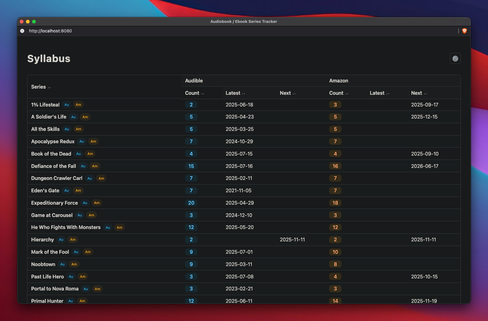

# Syllabus

A small Go web app that reads a YAML list of audiobook series and displays live series metadata by scraping Audible and Amazon. It exposes a simple web UI and a JSON API.

So I was maintaining this Obsidian "database" manually and got pretty tired of having to open up a ton of tabs and checking release dates periodically, resulting in Syllabus. Sample config is included to see how the screenshot below was created.

It's barebones and does just what I need it to do. I'm lazy and haven't added my docker-compose yet, but will.



## Features

- Parse series from a YAML file
- Fetch Audible series pages and count current audiobooks
- Extract the latest release date from Audible series pages
- Fetch Amazon pages to detect ebook series size and next release date
- In-memory caching with TTL
- Optional file watching to auto-reload YAML changes
- Minimal HTML table view and JSON API

## Requirements

- Go 1.24+
- Internet access
- A YAML file of series


## Run

```bash
go build . 
./Syllabus ./books.yaml
```

Open http://localhost:8080 for the UI. The API is available at /api/series.

## Configuration

YAML schema:

```yaml
audiobooks:
  - title: "1% Lifesteal"
    audible: "https://www.audible.com/series/1-Lifesteal-Audiobooks/B0F8QMLV9T"
    amazon: "https://www.amazon.com/dp/B0DGWCJ6JP"
  - title: "A Soldier's Life"
    audible: "https://www.audible.com/series/A-Soldiers-Life-Audiobooks/B0D34549LX"
    amazon: "https://www.amazon.com/dp/B0CW18NDBQ"
```

Only title, audible, and amazon are required for scraping.

## Data Sources

Audible:
- AudibleCount is the number of occurrences of the substring `productlistitem` in the series page HTML
- Audible Latest is the last occurrence of `Release date: MM-DD-YY `parsed from the series page

Amazon:
- Amazon Count is parsed from the element with id `collection-size` in the form `(N book series)`
- Amazon Next is parsed from a span with class `a-color-success a-text-bold` containing a date like `Month D, YYYY`

## JSON API

GET /api/series

Returns an array of objects with fields:
- Title
- AudibleCount
- AudibleLatestTitle
- AudibleLatestDate
- AudibleNextTitle
- AudibleNextDate
- AmazonCount
- AmazonLatestTitle
- AmazonLatestDate
- AmazonNextTitle
- AmazonNextDate
- AudibleID
- AmazonASIN
- Err

Dates are ISO 8601 when returned from the API.

## Caching

Responses from providers are cached in memory for 6 hours.

## File Watching

If enabled in the code, the application watches the directory of the YAML file and reloads data when the file changes. The cache is cleared on reload.
