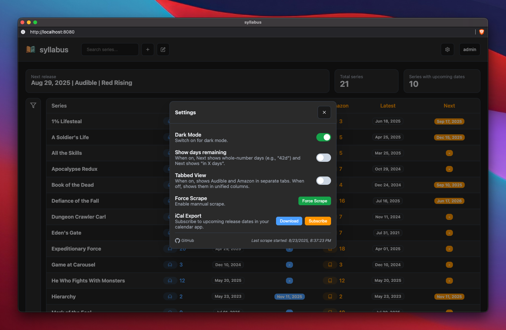

# syllabus

A Go web application that tracks audiobook series release dates by scraping Audible and Amazon. Features user authentication, database persistence, background scraping, and automatic refresh capabilities with a clean web UI and JSON API.

Originally created to replace manual maintenance of an Obsidian "database" for tracking audiobook release dates. Sample config is included to see how the screenshots below were created.

I call it `syllabus` because it's a list of things to read.

Perfect for homelab deployment with Docker Compose for automated audiobook series tracking. 

### Desktop


### Settings


### Mobile


## Features

### Core Functionality
- **YAML Configuration**: Parse audiobook series from a simple YAML file
- **Multi-Provider Scraping**: Fetch data from both Audible and Amazon
- **Release Date Tracking**: Extract latest and next release dates automatically
- **Database Persistence**: SQLite database for reliable data storage
- **Background Processing**: Multi-threaded background scraper with job queue
- **Real-time Updates**: Server-sent events for live UI updates

### User Experience
- **Authentication System**: Secure login with role-based access (Admin/User)
- **Responsive Web UI**: Clean, mobile-friendly interface
- **Auto-refresh**: Configurable automatic data refresh (2-10 hours)
- **Manual Refresh**: On-demand data refresh with progress tracking
- **iCal Export**: Subscribe to release date calendar in your favorite app
- **Settings Panel**: Manage refresh intervals and preferences

### Technical Features
- **File Watching**: Auto-reload when YAML configuration changes
- **Graceful Shutdown**: Clean application termination handling
- **Docker Support**: Full containerization with Docker Compose
- **JSON API**: Programmatic access to series data
- **Rate Limiting**: Intelligent scraping to avoid provider restrictions

## Quick Start

### Default Credentials
- **Username**: `admin`  
- **Password**: `admin`

⚠️ **Change the default password immediately after first login**

## Requirements

- Go 1.21+ (for local development)
- Docker & Docker Compose (recommended)
- Internet access for scraping
- YAML configuration file

## Configuration

YAML schema:

```yaml
audiobooks:
  - title: "1% Lifesteal"
    audible: "https://www.audible.com/series/1-Lifesteal-Audiobooks/B0F8QMLV9T"
    amazon: "https://www.amazon.com/dp/B0DGWCJ6JP"
  - title: "A Soldier's Life"
    audible: "https://www.audible.com/series/A-Soldiers-Life-Audiobooks/B0D34549LX"
    amazon: "https://www.amazon.com/dp/B0CW18NDBQ"
```

Only title, audible, and amazon are required for scraping.

## Installation & Deployment

### Docker Compose (Recommended)

```bash
git clone https://github.com/michaeldvinci/syllabus.git
cd syllabus

# Build and start
docker compose up -d

# View logs
docker compose logs -f
```

### Local Development

```bash
git clone https://github.com/michaeldvinci/syllabus.git
cd syllabus

# Run directly
go run cmd/syllabus/main.go config/books.yaml

# Or build first
go build -o syllabus cmd/syllabus/main.go
./syllabus config/books.yaml
```

### Access the Application

- **Web UI**: http://localhost:8080
- **Login**: Use `admin` / `admin` (change immediately!)
- **JSON API**: http://localhost:8080/api/series
- **Calendar**: http://localhost:8080/calendar.ics

## Data Sources & Scraping

### Audible Scraping
- **Series Count**: Number of `productlistitem` occurrences in series page HTML
- **Latest Release**: Most recent `Release date: MM-DD-YY` from series page
- **Next Release**: Extracted from "Coming Soon" or pre-order sections

### Amazon Scraping  
- **Series Count**: Parsed from `collection-size` element as `(N book series)`
- **Next Release**: Date from `a-color-success a-text-bold` span elements
- **Series Detection**: Automatic ASIN extraction from Amazon URLs

### Background Processing
- **Multi-threaded**: 4 concurrent workers for faster scraping
- **Job Queue**: Persistent SQLite-based job management  
- **Rate Limiting**: Intelligent delays to respect provider limits
- **Error Handling**: Automatic retry logic with exponential backoff

## API Reference

### Authentication Required
All API endpoints require authentication via session cookie (login at `/login`).

### GET /api/series
Returns an array of series objects with the following fields:

```json
{
  "Title": "Series Name",
  "AudibleCount": 5,
  "AudibleLatestTitle": "Book Title",
  "AudibleLatestDate": "2024-01-15T00:00:00Z",
  "AudibleNextTitle": "Next Book Title", 
  "AudibleNextDate": "2024-03-20T00:00:00Z",
  "AmazonCount": 5,
  "AmazonLatestTitle": "Book Title",
  "AmazonLatestDate": "2024-01-15T00:00:00Z",
  "AmazonNextTitle": "Next Book Title",
  "AmazonNextDate": "2024-03-20T00:00:00Z",
  "AudibleID": "B0EXAMPLE",
  "AmazonASIN": "B08EXAMPLE",
  "Err": null
}
```

### POST /refresh
Triggers a manual refresh of all series data.

### GET /calendar.ics
Returns iCal calendar file with all upcoming release dates.

### POST /api/auto-refresh
Updates automatic refresh interval (Admin only).
```json
{"interval": 6}
```

All dates are returned in ISO 8601 format.

## Data Storage & Persistence

### SQLite Database
- **Location**: `./data/syllabus.db` 
- **Schema**: Series, books, and job queue tables
- **Persistence**: Survives application restarts
- **Migration**: Automatic schema updates on startup

### User Management
- **Storage**: `./data/users.json`
- **Encryption**: bcrypt password hashing
- **Roles**: Admin and User access levels
- **Default**: Admin user created on first run

### Configuration Watching
- **Auto-reload**: YAML file changes trigger incremental updates
- **Smart Updates**: Only new series are scraped, existing data preserved
- **Hot Refresh**: No application restart required

## Auto-Refresh System

### Configurable Intervals
- **Options**: 2, 4, 6, 8, 10 hours
- **Default**: 6 hours
- **UI Control**: Settings panel slider
- **Persistence**: Interval survives restarts

### Refresh Behavior
- **Incremental**: Only updates stale data
- **Background**: Non-blocking operation
- **Progress**: Real-time updates via Server-Sent Events
- **Manual Override**: Refresh button forces immediate update

## Troubleshooting

### Log Locations
- **Docker**: `docker compose logs syllabus`
- **Local**: Console output
- **Scraper**: Detailed job progress in logs
